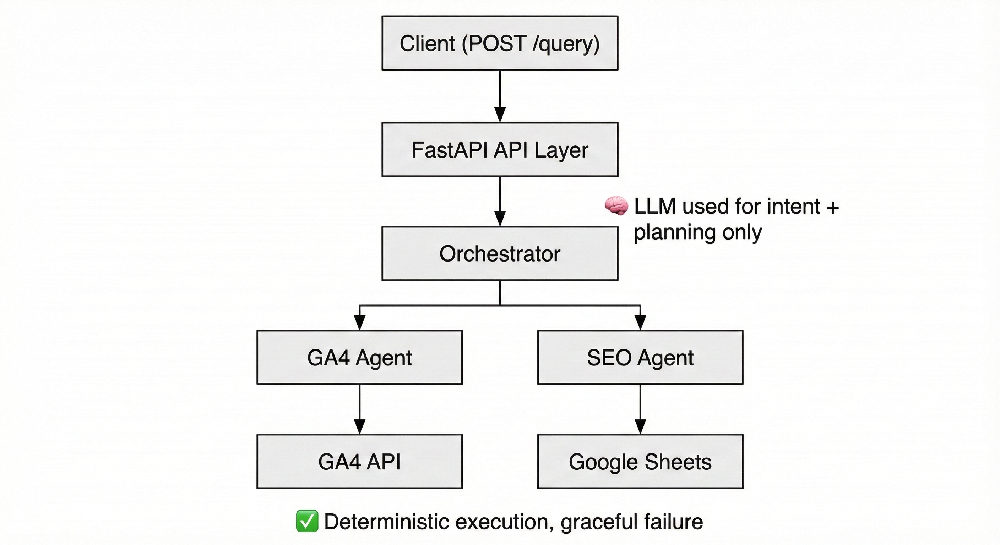

# Spike AI BuildX – Multi-Agent Backend
## Team BeingNotified

This project implements a production-ready multi-agent backend aligned with
Spike AI’s **Marketing AGI** philosophy.

The system demonstrates safe orchestration of autonomous agents under
real-world data availability constraints.

---

## 🧠 Supported Capabilities

### Tier-1: GA4 Analytics Agent
- Deterministic query planning
- Metric & dimension validation
- Page-level filtering
- Graceful handling of missing credentials

### Tier-2: SEO Agent
- Rule-based SEO issue detection
- Screaming Frog–style crawl analysis
- Google Sheets ingestion with safe fallback

---

## 🚀 How to Run (Evaluator Instructions)

### 1. Clone the repository
```bash
git clone <repo-url>
cd <repo>
```

### 2. Create virtual environment
```bash
python -m venv .venv
source .venv/bin/activate
pip install -r requirements.txt
```

### 3. (Optional) Add GA4 Credentials

For GA4 analytics evaluation, place a valid `credentials.json`
in the project root.

> If credentials are not provided, the system will still start and
> respond gracefully to analytics queries.

### 4. Run the service
```bash
uvicorn app.main:app --host 0.0.0.0 --port 8080
```

The service will be available at:
```
http://localhost:8080
```

---

## 🔌 API Usage

### POST `/query`

**Request**
```json
{
  "query": "Which URLs have title tags longer than 60 characters?"
}
```

**Response**
- `answer`: Human-readable insight
- `data`: Structured execution details (if applicable)

---
## 🧠 Architecture Overview

This system is designed as a **production-ready, multi-agent backend**
aligned with Spike AI’s Marketing AGI philosophy.

The architecture follows a **clean separation of concerns** with a
central orchestrator coordinating specialized agents.

---

### High-Level Flow

1. The user sends a natural language query to a single API endpoint:  
   `POST /query`

2. The **Orchestrator** performs:
   - Deterministic intent detection (SEO vs Analytics)
   - Safe LLM-assisted reasoning where required
   - Agent routing and response aggregation

3. The request is routed to the appropriate agent:
   - **GA4 Analytics Agent (Tier-1)**
   - **SEO Agent (Tier-2)**

4. Each agent:
   - Executes only deterministic, validated operations
   - Never hallucinates data
   - Fails gracefully when inputs or credentials are missing

5. The orchestrator returns:
   - A human-readable answer
   - Structured execution metadata (for evaluation/debugging)

---
### Detailed Architecture (Reference)

The following diagram illustrates internal agent boundaries,
execution flow, and design principles used in the system.



## 🔍 Detailed Architecture (Reference)


### Core Components

#### 1️⃣ API Layer (FastAPI)
- Exposes a **single POST endpoint**: `/query`
- Accepts natural language questions in JSON
- Acts as the only public interface (no UI required)

---

#### 2️⃣ Orchestrator
- Central decision-making layer
- Responsibilities:
  - Intent detection (analytics / SEO)
  - Agent routing
  - Cross-agent safety guarantees
- Uses LLMs **only for reasoning**, never for execution

---

#### 3️⃣ GA4 Analytics Agent (Tier-1)
- Queries live Google Analytics 4 data using the GA4 Data API
- Features:
  - Deterministic query planning
  - Metric & dimension validation
  - Page-level filtering via `pagePath`
  - Time-series vs aggregate inference
- If GA4 credentials are missing:
  - The agent fails gracefully
  - The service remains operational

---

#### 4️⃣ SEO Agent (Tier-2)
- Analyzes Screaming Frog crawl data
- Data source:
  - Google Sheets provided in the problem statement
- Capabilities:
  - Rule-based SEO issue detection (e.g. long titles, non-indexable pages)
  - Supports multi-sheet ingestion
  - Safe fallback when data is unavailable
- Never assumes local files or manual preprocessing

---

### LLM Usage Strategy

LLMs (via LiteLLM) are used **strictly for cognition**, not execution:
- Intent detection
- GA4 query planning
- Natural language summarization

All final execution is:
- Deterministic
- Validated
- Reproducible

---

### Design Principles

- **Fail gracefully, never crash**
- **No hallucinated data**
- **Single-entry API**
- **Extensible agent architecture**
- **Evaluator-friendly automation**

> “LLMs reason. Code enforces. Systems fail gracefully.”


## 🧪 Evaluation Notes

- The system is designed for **automated evaluation**
- No UI or manual steps are required
- All failures are handled gracefully
- No hallucinated analytics or SEO data is returned

---
### GA4 Credentials

A valid `credentials.json` file must be present at the project root for GA4 access.

For security reasons, this file is committed.
A template is provided as `credentials.json` and contains dummy strings.

During automated evaluation, `credentials.json` will be injected by evaluators.


## 📄 Documentation

- `ASSUMPTIONS.md` — Design decisions & constraints
- `deploy.sh` — Automated deployment entrypoint
